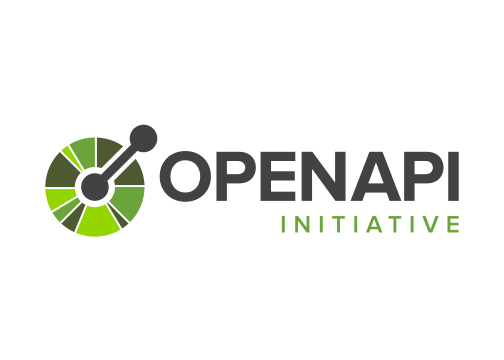

<h1 align="center">Apib To OAS</h1>

<p align="center">
  <em>Convert API Blueprint (MSON included) into clean OpenAPI 3.0 / 3.1 / 3.2.</em>
</p>

<p align="center">
  
  &nbsp;&nbsp;&nbsp;➡&nbsp;&nbsp;&nbsp;
  
</p>

<p align="center">
  <a href="https://github.com/alecoletti/apib-to-oas/actions/workflows/tests.yml">
    
  </a>
  <a href="https://github.com/alecoletti/apib-to-oas/releases">
    
  </a>
  <a href="https://github.com/alecoletti/apib-to-oas/pkgs/container/apib-to-oas">
    
  </a>
  
  <a href="LICENSE.txt">
    
  </a>
</p>

---

> [!IMPORTANT]
> **Apiary shuts down on October 31, 2026.** If you still have `.apib`
> files hosted there, export them now and run them through
> `apib-to-oas` before the lights go out for good.

## Why this exists

API Blueprint is dead. Oracle is shutting down [Apiary](https://apiary.io)
on October 31, 2026, taking the last hosted `.apib` docs with it.
[Drafter](https://github.com/apiaryio/drafter), the parser, hasn't
shipped a release in years. OpenAPI won.

But a lot of us still have piles of working `.apib` files and no
appetite for hand-rewriting thousands of lines of MSON into YAML.
APIB was — and frankly still is — nicer to write than raw JSON Schema.
Throwing all that authoring intent away just to chase the new hotness
feels like a waste.

`apib-to-oas` is a one-shot migration tool. Point it at your `.apib`,
get clean OpenAPI back, ship it, and move on. The conversion rules are
written down in [`specs/apib+.md`](specs/apib+.md) ("Blueprint+") so
the output is predictable, not vibes-based.

It's a nostalgic project. APIB is dead. Long live API Blueprint.

Sure, in the era of AI, writing JSON or YAML by hand isn't really
cumbersome anymore — an LLM will happily belch out a thousand lines of
OpenAPI before you finish your coffee. But API Blueprint is still more
fun to write. The Markdown reads like documentation, MSON looks like
something a human would write, and diffs are actually readable.

Maybe it doesn't need a deeper meaning. It just needs to be useful.

## Quick start

> [!TIP]
> If you don't want to install anything, the Docker one-liner below is
> the fastest way to convert a single file. It also doubles as the
> reference invocation for CI pipelines.

```bash
# One-shot, via Docker, no install needed:
docker run --rm -v "$PWD":/work ghcr.io/alecoletti/apib-to-oas:latest \
  convert spec.apib -o openapi.yaml
```

Or install the binary and use it directly:

```bash
apib-to-oas convert spec.apib -o openapi.yaml      # YAML
apib-to-oas convert spec.apib --format json        # JSON to stdout
apib-to-oas lint    spec.apib --strict             # parse + report only
```

## Install

### Pre-built binary

Grab the tarball for your platform from the
[releases page](https://github.com/alecoletti/apib-to-oas/releases),
drop `apib-to-oas` into your `PATH`, and check it works:

```bash
apib-to-oas version
```

SHA-256 checksums are published as `checksums.txt` next to the tarballs.

### Docker

A multi-arch image (`linux/amd64`, `linux/arm64`) is pushed to GHCR on
every release. Based on `gcr.io/distroless/cc-debian12:nonroot` (~22 MB),
no shell, no package manager.

```bash
# Mount your CWD so apib-to-oas can read the .apib file.
docker run --rm -v "$PWD":/work ghcr.io/alecoletti/apib-to-oas:latest \
  convert spec.apib -o openapi.yaml

# Pipe through stdin / stdout, no mount needed.
cat spec.apib | docker run --rm -i ghcr.io/alecoletti/apib-to-oas:latest \
  convert - --format json > openapi.json
```

### From source

```bash
task build
./bin/apib-to-oas version
```

…or plain `go build`:

```bash
go build -o bin/apib-to-oas ./cmd/apib-to-oas
```

Tasks live in [`Taskfile.yml`](Taskfile.yml). Install
[Task](https://taskfile.dev) with `brew install go-task`.

## Usage

```text
apib-to-oas convert <file|-> [flags]

Flags:
  --oas-version       3.0 | 3.1 | 3.2          (default 3.0)
  --info-version      override info.version
  --security-config   path to a security sidecar JSON (specs/apib+.md §9.4)
  --strict            promote warnings to errors
  -q, --quiet         suppress non-error diagnostics
  -f, --format        yaml | json (defaults from -o extension, then yaml)
  -o, --output        file path or `-` for stdout
```

`apib-to-oas lint <file>` parses and reports diagnostics without writing
output. Combine with `--strict` for a CI-friendly check.

## How it works

```
.apib
  └─ Drafter (vendored, embedded via go:embed)
       └─ API Elements / Refract JSON
            └─ Blueprint+ post-processor (this project)
                 └─ Typed OpenAPI 3.x model
                      └─ YAML or JSON
```

Drafter does the heavy parsing. Everything else — schema resolution,
security, webhooks, hierarchical tags, format inference, the lot — is
pure Go inside `internal/convert`. The pipeline is deterministic: same
input, same bytes out, every run.

> [!NOTE]
> Drafter is the original C++ API Blueprint parser, last released in
> 2018 and effectively unmaintained. It still works perfectly for
> well-formed input — `apib-to-oas` ships its own prebuilt binaries
> (Linux + macOS, amd64 + arm64) baked in via `go:embed` so you never
> have to install or compile it yourself.

## Layout

| Path                       | What's in it                                     |
|----------------------------|--------------------------------------------------|
| `cmd/apib-to-oas/`         | CLI entrypoint                                   |
| `internal/cli/`            | argument parsing + command dispatch              |
| `internal/drafter/`        | embedded drafter binary + exec runner            |
| `internal/drafter/bin/`    | prebuilt drafter binaries (per `GOOS/GOARCH`)    |
| `internal/convert/`        | Refract → OAS translation                        |
| `internal/oas/`            | small OAS 3.x model                              |
| `testdata/`                | sample API Blueprint inputs                      |
| `specs/apib+.md`           | Blueprint+ language reference                    |
| `specs/apib+-converter.md` | converter contract (diagnostics, modes, sidecar) |

## Drafter binaries

Drafter source (v5.1.0) is vendored under `third_party/drafter-v5.1.0/`.
Build the binary for your host with:

```bash
scripts/build-drafter.sh
```

That writes `internal/drafter/bin/drafter-<GOOS>-<GOARCH>`, which
`go:embed` bakes into the next `apib-to-oas` build. Without a binary
for the current platform, `apib-to-oas convert` returns
`ErrUnsupportedPlatform`. See `internal/drafter/bin/README.md` for the
naming contract.

## Development

```bash
task test                  # go test ./...
task vet                   # go vet ./...
task run -- convert testdata/sample.apib
task --list                # show every task
```

Releasing? See [`docs/RELEASING.md`](docs/RELEASING.md) for the
release-please → goreleaser → GHCR pipeline.

## License

[MIT](LICENSE).

## Acknowledgements

- [API Blueprint](https://apiblueprint.org/) and
  [Drafter](https://github.com/apiaryio/drafter) by the original Apiary
  team — none of this works without their decade of effort.
- The folks who kept writing APIB even after the format was declared
  dead. This is for you.

## Trademarks

Logos shown for identification purposes only. *API Blueprint* and the
API Blueprint logo are trademarks of Oracle Corporation / Apiary;
asset taken from the public [`apiaryio/api-blueprint`](https://github.com/apiaryio/api-blueprint/blob/master/assets/logo_apiblueprint.png)
repository. *OpenAPI* and the OpenAPI logo are trademarks of the
OpenAPI Initiative (a Linux Foundation project); asset taken from
the [`OAI/OpenAPI-Style-Guide`](https://github.com/OAI/OpenAPI-Style-Guide/tree/main/graphics/vector)
repository and used under their published brand guidelines. This
project is not affiliated with, sponsored by, or endorsed by either.

